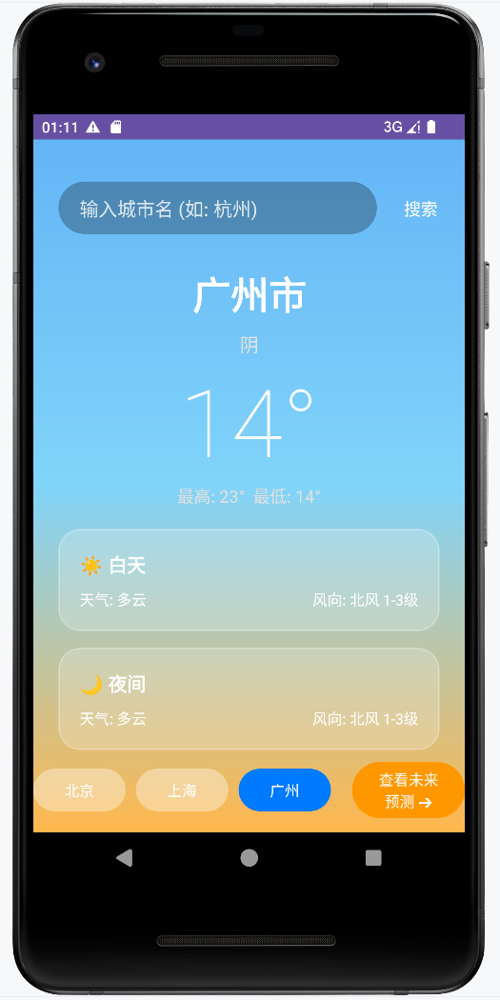
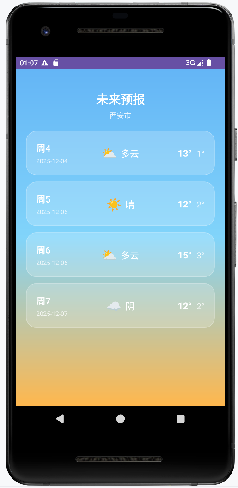

# 🌤️ MyWeather - Android 天气预报 App

一个基于 Android 原生开发 (Java) 的精美天气预报应用。集成了高德地图 (AMap) 天气 API，采用现代化 UI 设计（玻璃拟态 + 渐变背景），支持实时天气查询和未来天气预报。

## ✨ 功能特性 (Features)

* **实时天气实况**：显示当前城市的气温、天气状态（晴/雨/多云）、风向风力等。
* **未来天气预报**：独立的预报页面，展示未来几天的天气趋势、最高/最低温详情。
* **城市搜索**：支持输入城市名称（如“杭州”）快速查询天气。
* **快捷切换**：内置北京、上海、广州快捷按钮，一键切换常用城市。
* **UI 交互优化**：
    * **动态按钮反馈**：选中城市时按钮高亮显示。
    * **沉浸式视觉**：全屏渐变天空背景 (`bg_gradient_sky`)。
    * **玻璃拟态卡片**：半透明磨砂质感的信息展示框 (`bg_glass_card`)。
    * **动态图标**：根据天气状态自动匹配 Emoji 图标 (☀/🌧/☁)。

## 📱 界面预览 (Screenshots)

| 主页面 (Main) | 预报页面 (Forecast) |
|:---:|:---:|
|  |  |
> *注：请将你的应用截图放入项目的 `screenshots` 文件夹，或者替换上面的图片链接。*

## 🛠️ 技术栈 (Tech Stack)

* **语言**：Java
* **开发环境**：Android Studio
* **核心组件**：
    * `ConstraintLayout` (复杂布局)
    * `RecyclerView` (列表展示)
    * `OkHttp` / `AMap SDK` (网络请求与数据源)
* **数据源**：[高德地图 Android 定位与天气 SDK](https://lbs.amap.com/)

## 🚀 快速开始 (Getting Started)

### 1. 克隆项目
```bash  
git clone [https://github.com/qibai1/Byte-Training-Camp-Project.git](https://github.com/qibai1/Byte-Training-Camp-Project.git)
